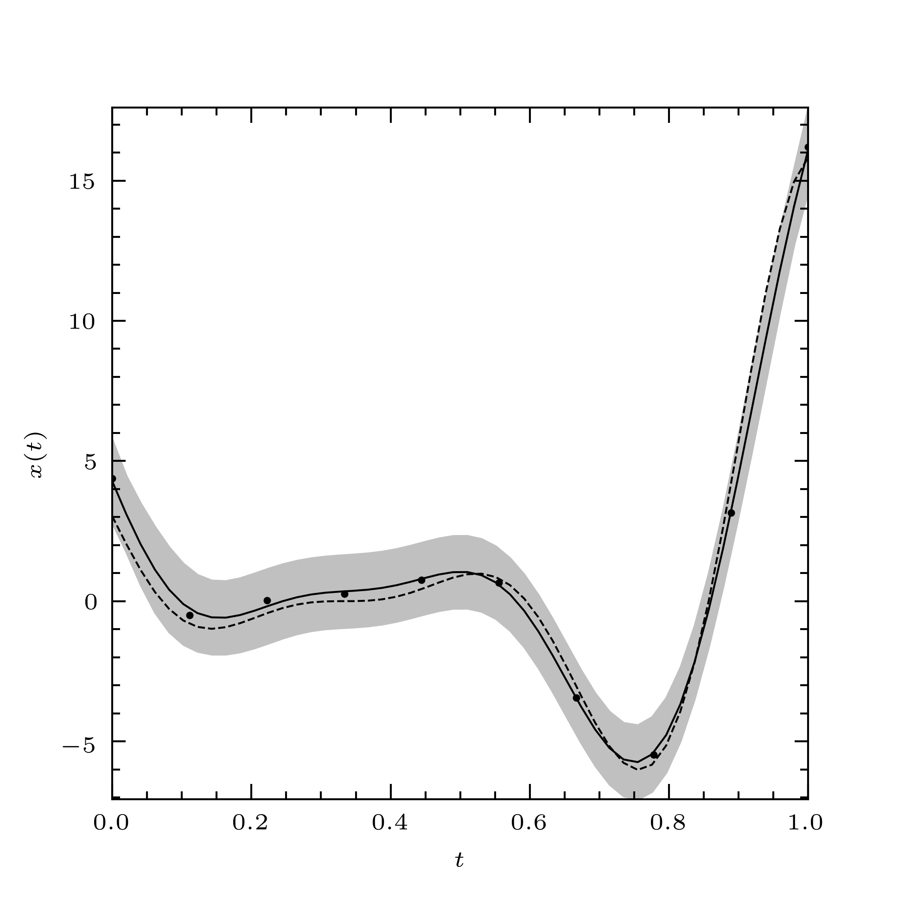
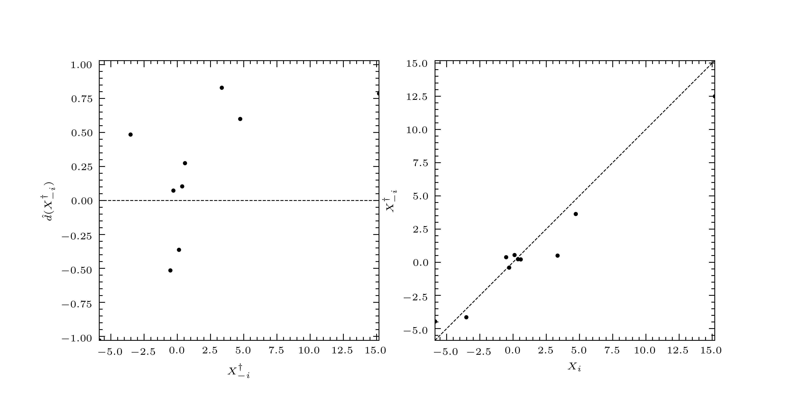

.. _quickstart_tutorial:

********************
Quick-start tutorial
********************

Kriging, DACE modelling, and Gaussian-process emulation may all be
considered to be applications of curve fitting. And in this respect,
curve fitting is the principal intended use of PyMimic. In this
quick-start tutorial we will fit a curve to some user-generated data.

Basic use of PyMimic for curve-fitting
######################################

Suppose that we have some data, which, for the sake of concreteness,
we take to be a noisy sample of the Forrester function, :math:`f: [0,
1] \longrightarrow \mathbf{R}` [F08_], given by

.. math::

   f(t) = (6t - 2)^{2}\sin(12t - 4),

namely :math:`(t_{i}, f(t_{i}) + \epsilon_{i})_{i = 1}^{n}`, where
:math:`\epsilon_{i}` is the error associated with the :math:`i`-th
element of the sample. We may fit a curve to this data using either
the best linear predictor (BLP) or the best linear unbiased predictor
(BLUP). First we must generate the sample. Second we must use this
sample to predict the value of the Forrester function for some
arbitrary argument, :math:`t_{*} \in [0, 1]`.

First, then, generate the sample. The Forrester function is included
in PyMimic's :mod:`testfunc` module, so we do not need to define it
ourselves. We will use Gaussian errors, though Gaussian errors are not
necessary.

.. sourcecode:: python

   >>> import numpy as np
   >>> import pymimic as mim
   >>> ttrain = np.linspace(0., 1., 10)
   >>> xtrain = mim.testfunc.forrester(ttrain) + 0.5*np.random.randn(10)

The Best linear unbiased predictor
**********************************

Let us fit a curve to the data using the BLUP. Using our sample we now
initialize an instance of the class :class:`Blup`. In order to do
this, we must specify a second-moment kernel. By default, PyMimic uses
the squared-exponential kernel.

   >>> blup = mim.Blup(ttrain, xtrain, var_error=0.5**2.))

Note that we have passed the variance of the error to :class:`Blup`, and not the
standard deviation.

Now tune the emulator using the class's optimization method.

.. sourcecode:: python

   >>> blup.opt()
      direc: array([[-4.71202552e-03,  2.63909305e-03],
                    [-9.97534341e-05,  6.29293728e-04]])
	fun: 36.52459551952859
    message: 'Optimization terminated successfully.'
       nfev: 291
	nit: 9
     status: 0
    success: True
	  x: array([1.55841236, 0.6449727 ])
   
(For an explanation of this output, see :ref:`Optimization
<tutorials>`.) Note that the parameter of the second-moment kernel has
been set to its maximum-likelihood estimate. This is stored as the
attribute :attr:`args`.

.. sourcecode:: python
		
   >>> blup.args
   (80.74538835868711, 31.626405926933707)

Now predict the value of the Forrester function, :math:`f(t_{*})`, for
some random element of the domain, :math:`t_{*}`. This is done by the
class method :meth:`xtest()`, which returns both the prediction and
the mean-squared error of that prediction.

.. sourcecode:: python

   >>> t = np.random.rand()
   >>> blup.xtest(t)
   (array([-5.14655856]), array([0.36967169]))

We may compare the prediction with :math:`f(t_{*})`.

.. sourcecode:: python

   >>> mim.testfunc.forrester(t)
   -5.561076962415382

We are not limited to computing one prediction at a time. In fact, we
may compute any number of predictions. Let us generate 50 predictions
and their mean-squared errors, spaced evenly across the Forrester
function's domain. We will assign these to variables, ``x`` and
``mse``, so that we can continue to use them.

.. sourcecode:: python

   >>> t = np.linspace(0., 1.)
   >>> x, mse = blup.xtest(t)

Now plot the predictions along with the true values of the
function. First, plot the predictions, and their three-sigma
prediction intervals.

.. sourcecode:: python

   >>> import matplotlib.pyplot as plt
   >>> plt.plot(t, x)
   >>> plt.fill_between(t, x - 3.*np.sqrt(mse), x + 3.*np.sqrt(mse), color="silver")
   >>> x_forrester = mim.testfunc.forrester(t)
   >>> plt.plot(t, x_forrester, color="k", ls="dashed")
   >>> plt.scatter(ttrain, xtrain)

..
   Finally, let us specify the plot furniture.

   .. sourcecode:: python

      >>> plt.xlabel(r"$t$")
      >>> plt.ylabel(r"$x(t)$")
      >>> plt.show()

We get the plot shown in :numref:`forrester_blup`.

.. _forrester_blup:

   The Forrester function (dashed line), a noisy sample of the
   Forrester function (filled circles) and a curve fitted to this
   sample using the BLUP (solid line). The three-sigma prediction
   interval for the fitted curve is also shown (solid grey band).

In general we are not able to compare the fitted curve directly with
the function underlying our data. Instead, we may assess the
performance of a fitted curve using leave-one-out
cross-validation. The leave-one-out cross-validation residuals and
their variance may be obtained as follows.

.. sourcecode:: python

   >>> blup.loocv
   (array([ 4.52392036, -2.19276424,  1.13209079, -0.37317826, -0.36070607,
            0.42370805,  0.05501436, -0.55527947, -0.394956  ,  4.57205699]),
    array([13.04227266,  3.0432301 ,  1.92073694,  1.73096003,  1.73091835,
	    1.73091835,  1.73096003,  1.92073694,  3.0432301 , 13.04227266]))

We may plot these as follows to give us :numref:`forrester_diagnostic`.

.. sourcecode:: python

   >>> mim.plot.diagnostic(xtrain, *blup.loocv)

.. _forrester_diagnostic:

   The standardized leave-one-out residuals (left), and leave-one-out
   predictors (right).

The standardized leave-one-out residuals are small and randomly
distributed so we say, in this case, that the predictor has passed
validation, and that we may trust the fitted curve and its associated
prediction interval.

   
The best linear predictor
*************************

We may fit a curve to the data using the BLP in exactly the same
way. Instead of using the class :class:`.Blup`, we use the class
:class:`.Blp`.

..
      >>> ttrain = np.linspace(0., 1., 10)
      >>> xtrain = mim.testfunc.forrester(ttrain) + 0.5*np.random.randn(10)

      >>> blp = mim.Blp(ttrain, xtrain, var_error=0.5*np.ones(10))

      >>> blp.opt()
	 direc: array([[-0.00307144,  0.05530654],
	     [-0.00358529,  0.00283301]])
	   fun: 37.81097462723378
       message: 'Optimization terminated successfully.'
	  nfev: 255
	   nit: 8
	status: 0
       success: True
	     x: array([1.56063599, 0.64158489])

      >>> blp.args
      [98.4197295018696, 30.572869889634603]

      >>> t = np.random.rand()
      >>> blp.xtest(t)
      (array([-0.55689444]), array([0.36244871]))

      >>> mim.testfunc.forrester(t)
      -0.8006808171799835

      >>> t = np.linspace(0., 1.)
      >>> x, mse = blp.xtest(t)

      >>> plt.plot(t, x)
      >>> plt.fill_between(t, x - 3.*np.sqrt(mse), x + 3.*np.sqrt(mse), color="silver")
      >>> x_forrester = mim.testfunc.forrester(t)
      >>> plt.plot(t, x_forrester, color="k", ls="dashed")
      >>> plt.scatter(ttrain, xtrain)
      >>> plt.xlabel(r"$t$")
      >>> plt.ylabel(r"$x(t)$")
      >>> plt.show()

      >>> blp.loocv
      (array([ 5.33555138, -2.33539139,  1.23586362, -0.37634087, -0.31120767,
	       0.44634957,  0.04341828, -0.39933071, -0.47531486,  4.90587593]),
       array([13.28139271,  3.1510248 ,  1.93291306,  1.73582116,  1.73362728,
	       1.73362728,  1.73582116,  1.93291306,  3.1510248 , 13.28139271]))

Kriging and emulation
#####################

In the case of vanishing obervational errors, the BLP and BLUP may be
used as interpolators. In the field of geostatistics the use of such
interpolators to construct maps of geological features is known as
\'Kriging\' [C86_]. In computer science the use of such interpolators
to construct metamodels of expensive simulations is known as \'DACE
modelling\' [S89_] or \'Gaussian-process emulation\' [RW06_].

References
##########

.. [F08]

   Forrester, A., Sobester, A., and A. Keane. 2008. *Engineering
   design via surrogate modelling: a practical guide*. Chichester:
   Wiley.

.. [C86]

   Cressie, N. 1986. 'Kriging nonstationary data' in *Journal of the
   American Statistical Association*, 81 (395): 625--34. Available at
   https://www.doi.org/10.1080/01621459.1986.10478315.

.. [RW06]

   Rasmussen, C.E., and C.K.I. Williams. 2006. *Gaussian processes for
   machine learning*. Cambridge: MIT Press.

.. [S89]

   Sacks, J., Welch, W. J., Mitchell, T.J.,
   and H. P. Wynn. 1989. 'Design and analysis of computer experiments'
   in *Statistical science*, 4 (4): 409--23. Available at
   https://www.doi.org/10.1214/ss/1177012413.
