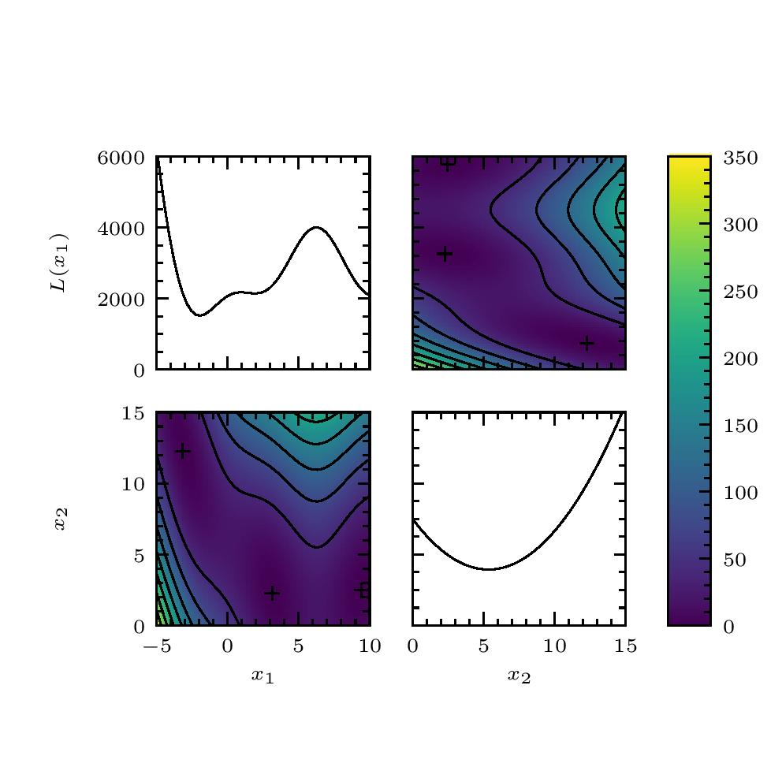

.. _plotting:

Plotting
========

The submodule :mod:`plot` is intended to help plot the results of
emulation. It contains a single function, :meth:`plot()`, which plots
all one- and two-dimensional marginalizations of a function of two or
more real numbers. We have already plotted the results of our
emulation of the Branin function. Of course the method :meth:`plot()`
works for any data, not just those generated by the method
:meth:`xtest()`. For example, we may plot the Branin function itself,
as follows.

.. sourcecode:: python

   >>> x = np.linspace(-5., 10., 50)
   >>> y = np.linspace(0., 15., 50)
   >>> xx, yy = np.meshgrid(x, y)
   >>> z = mim.testfunc.branin(xx, yy)
   >>> mim.plot.plot(z, extent=[[-5, 10.], [0., 10.]])
   >>> plt.show()

We may plot the experimental design using the keyword ``design``.

.. sourcecode:: python

   >>> mim.plot.plot(z, extent=[[-5, 10.], [0., 10.]], design=ttrain)
   >>> plot.show()
   
The result is shown :numref:`branin`.

.. _branin:

   The Branin function, plotted using the module :mod:`plot`.

Adding to a plot
----------------

The function :func:`plot()` returns an instance of the Matplotlib
class :class:`figure.Figure`. This may be treated like any other
:class:`figure.Figure` instance. We might want to add additional data
to it. For example, we might want to indicate the mimima of a
function. To do this we may extract the axes, as follows.

.. sourcecode:: python

   >>> fig = mim.plot.plot(z, extent=[[-5, 10.], [0., 10.]])
   >>> ax = fig.axes

And now we may now overplot each panel.

.. sourcecode:: python

   >>> min_x = [-np.pi, np.pi, 9.425]
   >>> min_y = [12.275, 2.275, 2.475]
   >>> ax[1].scatter(min_y, min_x)
   >>> ax[2].scatter(min_x, min_y)
   >>> plot.show()

The result is shown :numref:`branin_minima`.

.. _branin_minima:

   The Branin function and its minima, plotted using the module
   :mod:`plot`.
