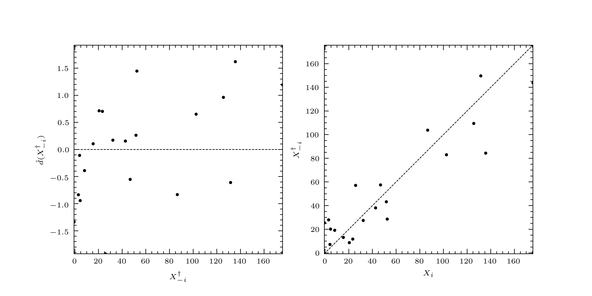

.. _validation:

**********
Validation
**********

We must always test the performance of a linear predictor, a procedure
known as \'validation\'. In leave-:math:`p`-out cross-validation,
instead of using a validation set distinct from :math:`X`, we
partition :math:`X` into a set containing :math:`p` elements,
:math:`X_{P}`, and a set containing :math:`n - p` elements,
:math:`X_{\bar{P}}`.  We construct a predictor for each :math:`X_{i}
\in X_{P}` based on :math:`X_{\bar{P}}`, namely
:math:`\hat{Z}_{i}`.

Commonly, :math:`p = 1`. We denote the :math:`j`-th leave-one-out
linear predictor of :math:`X_{j}` by :math:`\hat{X}_{- j}`. Similarly
we denote the :math:`j`-th leave-one-out linear predictor of
:math:`X_{j}` by :math:`\hat{X}_{- j}`. The leave-one-out
cross-validation linear predictor residual is

.. math::

   e(\hat{Z}_{- j}) = Z_{j} - \hat{Z}_{- j},

and the standardized leave-one-out cross-validation linear predictor
residual is

.. math::

   d(\hat{Z}_{- j}) = \dfrac{Z_{j} - \hat{Z}_{- j}}{\sqrt{\operatorname{var}(\hat{Z}_{- j})}}.
   
The behaviour of the observed predictor residuals should be consistent
with the assumptions we have made about their distribution.

A good summary statistic is provided by the leave-one-out
cross-validation score

.. math::

   R^{2} = \dfrac{1}{n}\sum_{i}d(\hat{Z}_{- i})^{2}.

PyMimic and validation
######################

The LOO residuals and their variances are stored as the attribute
:attr:`loocv` belonging to the classes :class:`BLP` and
:class:`BLUP`. The module :mod:`mim.plot` contains the function
:func:`diagnostic()`, which plots (1) the standardized LOO residuals
against the LOO predictions and (2) the LOO predictions against
against their true values.

Let us validate the predictor we used in fitting a curve to a noisy
sample of the Branin function.

Generate the sample.

.. sourcecode:: python

   >>> import pymimic as mim
   >>> bounds = [[-5., 10.], [0., 15.]]
   >>> ttrain = mim.design(bounds)
   >>> xtrain = mim.testfunc.branin(*ttrain.T) + 10.*np.random.randn(20)
   
Then create a BLUP object.

.. sourcecode:: python

   >>> blup = mim.Blup(ttrain, xtrain, 10.**2.)
   >>> blup.opt()
      direc: array([[1., 0., 0.],
	  [0., 1., 0.],
	  [0., 0., 1.]])
	fun: 169.40632097688868
    message: 'Optimization terminated successfully.'
       nfev: 146
	nit: 3
     status: 0
    success: True
	  x: array([1.57069249, 0.08700307, 0.01322379])

Now compute the the LOO prediction residuals and their variances.

.. sourcecode:: python

   >>> blup.loocv
   (array([ 51.2065913 , -25.12770775,  19.39411263, -26.15146519,
	    4.46734306, -15.74786283,  23.69329757,   4.60761066,
	   11.70811329, -17.17898489,   2.20727369, -31.45013478,
	   31.868371  ,  11.49837525,  16.08973502, -11.11629167,
	  -10.78144937, -18.14250451,  -3.22056033,   8.3367355 ]),
    array([999.76676916, 904.42982646, 888.29496818, 382.93648001,
 	   817.77977058, 279.85877825, 267.51340703, 712.60225493,
	   267.13441485, 426.51943097, 426.51943097, 267.13441485,
	   712.60225493, 267.51340703, 279.85877825, 817.77977058,
	   382.93648001, 888.29496818, 904.42982646, 999.76676916]))

Also compute the LOOCV validation score.

.. sourcecode:: python

   >>> blp.R2
   9992.090822466882
   
Now plot the results.

.. sourcecode:: python

   >>> mim.plot.diagnostic(xtrain, *blup.loocv)

The result is show in :numref:`branin_blp`.

.. _branin_diagnostic:

   Left: the standardized LOO residuals plotted against the LOO
   predictions. Right: the LOO predictions plotted against their true
   values.

The standardized LOO residuals are small and randomly
distributed. When plotted against their true values, the predictions
lie around the diagonal. So we say, in this case, that the predictor
has passed validation, and that we may trust the fitted curve and its
associated prediction interval.
