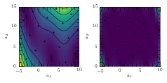
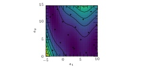
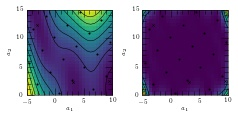

.. _pymimic_and_gpe:

GPE and PyMimic
===============

GPE is implemented in PyMimic using the function :func:`pymimic.gpe`. It
assumes that the regression function :math:`r` is the zero function such that
:math:`r(\boldsymbol{x}) = 0` for all :math:`\boldsymbol{x}`.The class of
covariance function may be chosen from a library provided by the
``pymimic.covfunc`` subpackage. By default a squared-exponential covariance
function is used. The covariance function may, alternatively, be specified by
the user in the form of a callable object. Designs may be computed using the
function :func:`pymimic.design`.

Emulation of noiseless functions
--------------------------------

GPE is most frequently used to predict the outputs of expensive computer
simluations that are multivariable and have zero error. We illustrate this use 
by emulating the two-variable Branin function, :math:`f: [-5, 10] \times [0,
15] \longrightarrow \boldsymbol{R}`, such that

.. math::
   
   f(x, y) = a (y - bx^2 + cx - r)^2 + s(1 - t) \cos x + s,

where :math:`a = 1`, :math:`b = 5.1 / (4 \pi^2)`, :math:`c = 5 / \pi`,
:math:`r = 6`, :math:`s = 10`, and :math:`t = 1 / (8 \pi)`. The example is
artifical, as the function is cheap enough that we may always evaluate it
directly. Suppose, however, that it were expensive to evaluate and that we
wished to make as few evaluations as possible.

The process is two-fold. First we must generate a set of training data for the
function. Second we must use these training data to estimate the value
:math:`f(x_{*}, y_{*})` for arbitrary :math:`(x_{*}, y_{*}) \in [-5, 10]
\times [0, 15]`.

Generate the training input. We may do this using :func:`pymimic.design`. By
default this returns a design of size :math:`10D` using Latin-hypersquare
sampling.

.. sourcecode:: python

   >>> import pymimic as mim
   >>> bounds = ((-5., 10.), (0., 15.))
   >>> xtrain = mim.design(bounds)

Generate the training output. The Branin function is included in PyMimic's
distribution so we do not need to code it up.

.. sourcecode:: python

   >>> ytrain = [mim.testfunc.branin(xi) for xi in xtrain]

Generate the GPE prediction of the function's value for random :math:`x`. This
is done by the function :func:`mim.gpe`, which returns a ``GpeResult`` object,
with attributes including ``y``, the prediction, and ``var``, the variance
associated with this prediction. Ignore the other attributes for the time
being, they may be used in more advanced applications.

.. sourcecode:: python
 
   >>> x = mim.design(bounds, 'random', 1)
   >>> mim.gpe(x, xtrain, ytrain)
	       x: array([[  5.58062116,  13.13597825]])
	       y: array([ 162.1915564])
	     var: array([ 1.58328788])
	  xtrain: array([[ -4.625,   5.625],
			 [ -3.875,  11.625],
			 [ -3.125,   1.875],
			 [ -2.375,   7.875],
			 [ -1.625,  13.875],
			 [ -0.875,   4.125],
			 [ -0.125,  10.125],
			 [  0.625,   0.375],
			 [  1.375,   6.375],
			 [  2.125,  12.375],
			 [  2.875,   2.625],
			 [  3.625,   8.625],
			 [  4.375,  14.625],
			 [  5.125,   4.875],
			 [  5.875,  10.875],
			 [  6.625,   1.125],
			 [  7.375,   7.125],
			 [  8.125,  13.125],
			 [  8.875,   3.375],
			 [  9.625,   9.375]])
	  ytrain: array([ 119.39627304,  9.02713491,  107.73211284,
	                   10.01971331, 33.95857366,   27.4883314 ,
			   34.92526652,   39.69632647, 17.24648401,
			   89.10338824,  0.75475629,   46.3452829 ,
			  178.83404287, 27.08972886,  114.19714214,
			   19.04661156, 48.48720402,  140.3274732 ,
			    3.56768629, 45.82784318])
	    yerr: array([ 0.,  0.,  0.,  0.,  0.,  0.,  0.,  0.,  0.,  0.,
	                  0.,  0.,  0.,  0.,  0.,  0.,  0.,  0.,  0.,  0.])
	 covfunc: <function se at 0x7f63c38a62f0>
	     hyp: [31036.294, 0.0689548136, 0.00520141501]
	K_xtrain: array([[  3.10362940e+04, 2.77195595e+04, 2.76883204e+04,
			    2.57246414e+04, 1.90649196e+04, 1.90005356e+04,
			    1.46483175e+04, 1.11695549e+04, 8.95764852e+03,
			    5.73040215e+03, 4.35967186e+03, 2.90122316e+03,
			    1.54007333e+03, 1.16904352e+03, 6.45546001e+02,
			    3.74915793e+02, 2.15360723e+02, 9.86806948e+01,
			    5.71819965e+01, 2.72559462e+01],
			 [  2.77195595e+04, 3.10362940e+04, 2.37726080e+04,
			    2.76883204e+04, 2.57246414e+04, 1.96596996e+04,
			    1.90005356e+04, 1.11099129e+04, 1.11695549e+04,
			    8.95764852e+03, 5.22587965e+03, 4.35967186e+03,
			    2.90122316e+03, 1.68875675e+03, 1.16904352e+03,
			    5.20635651e+02, 3.74915793e+02, 2.15360723e+02,
			    9.56952320e+01, 5.71819965e+01],
			 [  2.76883204e+04, 2.37726080e+04, 3.10362940e+04,
			    2.77195595e+04, 1.97485732e+04, 2.57246414e+04,
			    1.90649196e+04, 1.90005356e+04, 1.46483175e+04,
			    9.00829452e+03, 8.95764852e+03, 5.73040215e+03,
			    2.92421377e+03, 2.90122316e+03, 1.54007333e+03,
			    1.16904352e+03, 6.45546001e+02, 2.84352234e+02,
			    2.15360723e+02, 9.86806948e+01],
			 [  2.57246414e+04, 2.76883204e+04, 2.77195595e+04,
			    3.10362940e+04, 2.77195595e+04, 2.76883204e+04,
			    2.57246414e+04, 1.96596996e+04, 1.90005356e+04,
			    1.46483175e+04, 1.11695549e+04, 8.95764852e+03,
			    5.73040215e+03, 4.35967186e+03, 2.90122316e+03,
			    1.68875675e+03, 1.16904352e+03, 6.45546001e+02,
			    3.74915793e+02, 2.15360723e+02],
			 [  1.90649196e+04, 2.57246414e+04, 1.97485732e+04,
			    2.77195595e+04, 3.10362940e+04, 2.37726080e+04,
			    2.76883204e+04, 1.62263502e+04, 1.96596996e+04,
			    1.90005356e+04, 1.11099129e+04, 1.11695549e+04,
			    8.95764852e+03, 5.22587965e+03, 4.35967186e+03,
			    1.94597139e+03, 1.68875675e+03, 1.16904352e+03,
			    5.20635651e+02, 3.74915793e+02],
			 [  1.90005356e+04, 1.96596996e+04, 2.57246414e+04,
			    2.76883204e+04, 2.37726080e+04, 3.10362940e+04,
			    2.77195595e+04, 2.76883204e+04, 2.57246414e+04,
			    1.90649196e+04, 1.90005356e+04, 1.46483175e+04,
			    9.00829452e+03, 8.95764852e+03, 5.73040215e+03,
			    4.35967186e+03, 2.90122316e+03, 1.54007333e+03,
			    1.16904352e+03, 6.45546001e+02],
			 [  1.46483175e+04, 1.90005356e+04, 1.90649196e+04,
			    2.57246414e+04, 2.76883204e+04, 2.77195595e+04,
			    3.10362940e+04, 2.37726080e+04, 2.76883204e+04,
			    2.57246414e+04, 1.96596996e+04, 1.90005356e+04,
			    1.46483175e+04, 1.11695549e+04, 8.95764852e+03,
			    5.22587965e+03, 4.35967186e+03, 2.90122316e+03,
			    1.68875675e+03, 1.16904352e+03],
			 [  1.11695549e+04, 1.11099129e+04, 1.90005356e+04,
			    1.96596996e+04, 1.62263502e+04, 2.76883204e+04,
			    2.37726080e+04, 3.10362940e+04, 2.77195595e+04,
			    1.97485732e+04, 2.57246414e+04, 1.90649196e+04,
			    1.12707694e+04, 1.46483175e+04, 9.00829452e+03,
			    8.95764852e+03, 5.73040215e+03, 2.92421377e+03,
			    2.90122316e+03, 1.54007333e+03],
			 [  8.95764852e+03, 1.11695549e+04, 1.46483175e+04,
			    1.90005356e+04, 1.96596996e+04, 2.57246414e+04,
			    2.76883204e+04, 2.77195595e+04, 3.10362940e+04,
			    2.77195595e+04, 2.76883204e+04, 2.57246414e+04,
			    1.90649196e+04, 1.90005356e+04, 1.46483175e+04,
			    1.11695549e+04, 8.95764852e+03, 5.73040215e+03,
			    4.35967186e+03, 2.90122316e+03],
			 [  5.73040215e+03, 8.95764852e+03, 9.00829452e+03,
			    1.46483175e+04, 1.90005356e+04, 1.90649196e+04,
			    2.57246414e+04, 1.97485732e+04, 2.77195595e+04,
			    3.10362940e+04, 2.37726080e+04, 2.76883204e+04,
			    2.57246414e+04, 1.96596996e+04, 1.90005356e+04,
			    1.11099129e+04, 1.11695549e+04, 8.95764852e+03,
			    5.22587965e+03, 4.35967186e+03],
			 [  4.35967186e+03, 5.22587965e+03, 8.95764852e+03,
			    1.11695549e+04, 1.11099129e+04, 1.90005356e+04,
			    1.96596996e+04, 2.57246414e+04, 2.76883204e+04,
			    2.37726080e+04, 3.10362940e+04, 2.77195595e+04,
			    1.97485732e+04, 2.57246414e+04, 1.90649196e+04,
			    1.90005356e+04, 1.46483175e+04, 9.00829452e+03,
			    8.95764852e+03, 5.73040215e+03],
			 [  2.90122316e+03, 4.35967186e+03, 5.73040215e+03,
			    8.95764852e+03, 1.11695549e+04, 1.46483175e+04,
			    1.90005356e+04, 1.90649196e+04, 2.57246414e+04,
			    2.76883204e+04, 2.77195595e+04, 3.10362940e+04,
			    2.77195595e+04, 2.76883204e+04, 2.57246414e+04,
			    1.96596996e+04, 1.90005356e+04, 1.46483175e+04,
			    1.11695549e+04, 8.95764852e+03],
			 [  1.54007333e+03, 2.90122316e+03, 2.92421377e+03,
			    5.73040215e+03, 8.95764852e+03, 9.00829452e+03,
			    1.46483175e+04, 1.12707694e+04, 1.90649196e+04,
			    2.57246414e+04, 1.97485732e+04, 2.77195595e+04,
			    3.10362940e+04, 2.37726080e+04, 2.76883204e+04,
			    1.62263502e+04, 1.96596996e+04, 1.90005356e+04,
			    1.11099129e+04, 1.11695549e+04],
			 [  1.16904352e+03, 1.68875675e+03, 2.90122316e+03,
			    4.35967186e+03, 5.22587965e+03, 8.95764852e+03,
			    1.11695549e+04, 1.46483175e+04, 1.90005356e+04,
			    1.96596996e+04, 2.57246414e+04, 2.76883204e+04,
			    2.37726080e+04, 3.10362940e+04, 2.77195595e+04,
			    2.76883204e+04, 2.57246414e+04, 1.90649196e+04,
			    1.90005356e+04, 1.46483175e+04],
			 [  6.45546001e+02, 1.16904352e+03, 1.54007333e+03,
			    2.90122316e+03, 4.35967186e+03, 5.73040215e+03,
			    8.95764852e+03, 9.00829452e+03, 1.46483175e+04,
			    1.90005356e+04, 1.90649196e+04, 2.57246414e+04,
			    2.76883204e+04, 2.77195595e+04, 3.10362940e+04,
			    2.37726080e+04, 2.76883204e+04, 2.57246414e+04,
			    1.96596996e+04, 1.90005356e+04],
			 [  3.74915793e+02, 5.20635651e+02, 1.16904352e+03,
			    1.68875675e+03, 1.94597139e+03, 4.35967186e+03,
			    5.22587965e+03, 8.95764852e+03, 1.11695549e+04,
			    1.11099129e+04, 1.90005356e+04, 1.96596996e+04,
			    1.62263502e+04, 2.76883204e+04, 2.37726080e+04,
			    3.10362940e+04, 2.77195595e+04, 1.97485732e+04,
			    2.57246414e+04, 1.90649196e+04],
			 [  2.15360723e+02, 3.74915793e+02, 6.45546001e+02,
			    1.16904352e+03, 1.68875675e+03, 2.90122316e+03,
			    4.35967186e+03, 5.73040215e+03, 8.95764852e+03,
			    1.11695549e+04, 1.46483175e+04, 1.90005356e+04,
			    1.96596996e+04, 2.57246414e+04, 2.76883204e+04,
			    2.77195595e+04, 3.10362940e+04, 2.77195595e+04,
			    2.76883204e+04, 2.57246414e+04],
			 [  9.86806948e+01, 2.15360723e+02, 2.84352234e+02,
			    6.45546001e+02, 1.16904352e+03, 1.54007333e+03,
			    2.90122316e+03, 2.92421377e+03, 5.73040215e+03,
			    8.95764852e+03, 9.00829452e+03, 1.46483175e+04,
			    1.90005356e+04, 1.90649196e+04, 2.57246414e+04,
			    1.97485732e+04, 2.77195595e+04, 3.10362940e+04,
			    2.37726080e+04, 2.76883204e+04],
			 [  5.71819965e+01, 9.56952320e+01, 2.15360723e+02,
			    3.74915793e+02, 5.20635651e+02, 1.16904352e+03,
			    1.68875675e+03, 2.90122316e+03, 4.35967186e+03,
			    5.22587965e+03, 8.95764852e+03, 1.11695549e+04,
			    1.11099129e+04, 1.90005356e+04, 1.96596996e+04,
			    2.57246414e+04, 2.76883204e+04, 2.37726080e+04,
			    3.10362940e+04, 2.77195595e+04],
			 [  2.72559462e+01, 5.71819965e+01, 9.86806948e+01,
			    2.15360723e+02, 3.74915793e+02, 6.45546001e+02,
			    1.16904352e+03, 1.54007333e+03, 2.90122316e+03,
			    4.35967186e+03, 5.73040215e+03, 8.95764852e+03,
			    1.11695549e+04, 1.46483175e+04, 1.90005356e+04,
			    1.90649196e+04, 2.57246414e+04, 2.76883204e+04,
			    2.77195595e+04, 3.10362940e+04]])
      K_x_xtrain: array([[   738.93511787,  1414.30344962,  1636.22924227,
			    3257.74204658,  5173.94931851,  5972.336868  ,
			    9867.02031798,  8714.15758062, 14976.26047839,
			   20531.19816763, 18091.48672687, 25800.10165278,
			   29349.55428177, 25803.70389899, 30535.03289377,
			   20539.79915205, 25284.17481947, 24827.57544497,
			   16662.98053732, 17020.58419694]])
	     K_x: array([ 1.58328788])
   K_xtrain_cond: 84313.291302461745
	   alpha: array([ 0.03450236, -0.03507712,  0.05525202, -0.02106605,
                          0.03526817, -0.2756959 ,  0.07766327,  0.16276434,
			  0.32696419, -0.15961839, -0.33052609, -0.19710155,
			  0.1796772 ,  0.45474999, -0.18421837, -0.07611531,
			  -0.13396519,  0.07634111,  0.0499262 , -0.01585786])

We may compare the predicted value (attribute ``y``) to the true value.

.. sourcecode:: python

   >>> mim.branin(x)
      161.198082123
   
Furthermore, we may compute the one-sigma confidence region for the
prediction, as follows.

.. sourcecode:: python

   >>> result = mim.gpe(x, xtrain, ytrain)
   >>> import numpy as np
   >>> sigma = numpy.sqrt(result.var)
   >>> result.y + (- sigma, sigma)
   array([ 160.93326872,  163.44984408])

Now generate a *set* of predictions. Again, we may use :func:`pymimic.design`
to generate a lattice of training inputs filling the function's domain. As we
have already optimized the hyperparameters during the call to
:func:`pymimic.gpe` we may pass these using the keyword ``hyp``.

.. sourcecode:: python
      
   >>> x = mim.design(bounds, 'regular', 25)
   >>> result = mim.gpe(x, xtrain, ytrain, hyp=res.hyp)

Now plot these predictions.

.. sourcecode:: python

   >>> import matplotlib.pyplot as plt
   >>> z = result.y.reshape(25, 25)
   >>> x0 = np.linspace(-5., 10., 25)
   >>> x1 = np.linspace(0., 15., 25)
   >>> plt.contour(z, x0, x1)
   >>> plt.show()

And the variance associated with these predictions.

.. sourcecode:: python

   >>> z = result.var.reshape(25, 25)
   >>> plt.contour(z, x0, x1)
   >>> plt.show()

For comparison, let us plot the Branin function itself.

.. sourcecode:: python

   >>> z = [mim.testfunc.branin(xi) for xi in x)
   >>> plt.contour(z, x0, x1)
   >>> plt.show()

In general the predictions are very close to their equivalent values. However,
there is some discrepancy where the function takes on extreme values. Here,
the predictions are poor and the standard deviation in each prediction is too
small. We may correct for this by preprocessing the data (see
:ref:`preprocessing`).

Emulation of noisy functions
----------------------------

Suppose that there is some error associated with the output of function. We
may separate the matrix into two parts

.. math::

   \boldsymbol{K} = \boldsymbol{K}_\mathrm{signal} +
   \boldsymbol{K}_\mathrm{noise}

where :math:`\boldsymbol{K}_\mathrm{noise} =
\operatorname{diag}(\sigma_{\epsilon}^{2}(\boldsymbol{x}_1),
\sigma_{\epsilon}^{2}(\boldsymbol{x}_2), ...,
\sigma_{\epsilon}^{2}(\boldsymbol{x}_{n})).` We supply the diagonal elements of
this matrix using the keyword ``yerr``.

First generate some noisy data. We will again use the Branin function, this
time adding a normally-distributed error with standard deviation of 0.6, being
approximately 10 % of the global minimum.

Generate the training data as before.

.. sourcecode:: python

   >>> xtrain = mim.design(bounds)
   >>> ytrain = [mim.testfunc.branin(xi) + np.random.normal(scale=0.6) for xi
   in xtrain]

Create an array holding the diagonal elements of the noise covariance matrix.

.. sourcecode:: python

   >>> yerr = np.full((20,), 0.6)

Now compute the predictions.

.. sourcecode:: python

   >>> result = mim.gpe(x, xtrain, ytrain, yerr)

And plot them.

.. sourcecode:: python

   >>> z = result.y.reshape(25, 25)
   >>> plt.contour(z, x0, x1)
   >>> plt.show()

Along with their variance.
   
   >>> z = result.var.reshape(25, 25)
   >>> plt.contour(z, x0, x1)
   >>> plt.show()

