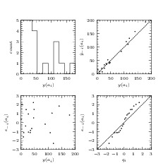

.. _pymimic_and_validation:

Validation and PyMimic
======================

Validation is performed in PyMimic using the functions
:func:`pymimic.loo_residuals`, :func:`pymimic.loocv_score`, and
:func:`pymimic.plot.validation`. These all take a ``GpeResult`` object as an
argument.

Suppose that we wish to validate the result of a GPE prediction for the Branin
function. First we must generate that prediction.

.. sourcecode:: python

   >>> import numpy as np
   >>> import pymimic_dev as mim
   >>> bounds = ((-5., 10.), (0., 10.))
   >>> xtrain = mim.design(bounds)
   >>> ytrain = [mim.testfunc.branin(xi) for xi in xtrain]
   >>> x = mim.design(bounds, 'random', 1)
   >>> result = mim.gpe(x, xtrain, ytrain)

Now generate the leave-one-out cross-validation score, as follows.

.. sourcecode:: python

   >>> mim.loocv_score(result)
   1702.7858914896569

And the standardized leave-one-out residuals.

.. sourcecode:: python

   >>> mim.loo_residual(res, standardized=True)
   array([  0.66855263, -0.5356262 , 0.83717352, -0.14055236,  0.42058524,
           -1.27874329,  0.30457355, 1.46828615,  1.17444687, -0.89892685,
	   -1.86143194, -0.70798365, 1.62085589,  1.78340196, -0.85444871,
	   -0.90770156, -0.89381363, 1.15671346, 0.76237098,  -0.30727793])

Now generate a matrix of diagnostic plots.

.. sourcecode:: python

   >>> import matplotlib.pyplot as plt
   >>> mim.plot.validation(res)
   >>> plt.show()

This function returns a matrix of the following plots:

   - histogram of training data;
   - sample values against equivalent LOO predicted values;
   - LOO residuals against sample values; and
   - ordered LOO residuals against equivalent quantiles of the normal
     distribution.

